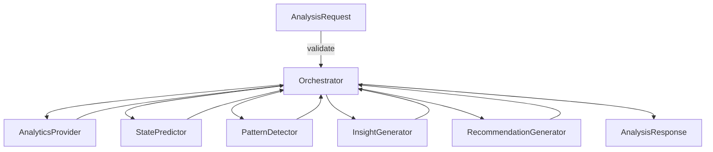

# 04. Модули AI‑сервиса

## Принцип модульности

AI‑сервис построен на модульной архитектуре. Вместо единого «монолитного» алгоритма используется набор взаимосвязанных компонентов, каждый из которых решает свою задачу и имеет чёткий интерфейс. Такой подход соответствует принципу **Core First**, описанному в роадмапе разработки: сначала реализуется ядро (аналитика), затем — прогноз состояния, паттерны, инсайты, рекомендации и далее ML‑расширения. Независимость модулей упрощает тестирование, сопровождение и развитие системы.

## Основные компоненты

### `AnalysisOrchestrator`

Главный координирующий компонент, который принимает `AnalysisRequest`, вызывает другие модули по очереди и формирует итоговый `AnalysisResponse`. Оркестратор отвечает за:

- валидацию входных данных;
- вызов `AnalyticsProvider` для расчёта суммарных показателей и категорий;
- вызов `StatePredictor` для определения финансового состояния;
- вызов `PatternDetector` для поиска паттернов;
- генерацию инсайтов и рекомендаций через `InsightGenerator` и `RecommendationGenerator`;
- сбор всех результатов в ответ.

### `AnalyticsProvider`

Ядро аналитики. Принимает список операций и рассчитывает:

- суммарные показатели (`totalIncome`, `totalExpense`, `balance`);
- группировку расходов по категориям и их доли;
- выборку топ‑3 категорий.

`AnalyticsProvider` не определяет финансовое состояние и не генерирует рекомендации. Он лишь подготавливает данные для последующих модулей.

### `StatePredictor`

Компонент, присваивающий финансовое состояние на основе rule‑based логики. Он анализирует итоговый баланс, соотношение доходов и расходов и распределение по категориям, чтобы вернуть одно из состояний: `STABLE`, `RISKY`, `EXPENSE_HEAVY`, `LOW_SAVINGS` или `NO_DATA`. Правила описаны в документе `06_financial_state_core.md`. В роадмапе предусмотрено расширение предиктора до ML‑модели CatBoost.

### `PatternDetector`

Компонент, обнаруживающий значимые паттерны расходов. Он получает агрегированные данные из `AnalyticsProvider` и ищет:

- превышение расходов над доходами;
- сильную концентрацию расходов в одной или нескольких категориях;
- крупные разовые платежи;
- частые мелкие траты;
- отсутствие доходов при наличии расходов.

Детальная логика описана в `07_pattern_detector.md`.

### `InsightGenerator`

Генерирует краткие аналитические выводы на основе данных `AnalyticsProvider`, состояния из `StatePredictor` и паттернов из `PatternDetector`. Инсайты объясняют структуру расходов, подчёркивают долю ведущих категорий и соотношение доходов и расходов. Шаблоны текстов и правила генерации приведены в `08_insight_generator.md`.

### `RecommendationGenerator`

Формирует персонализированные рекомендации для пользователя. Использует паттерны и финансовое состояние, чтобы предложить конкретные действия: оптимизировать расходы по определённым категориям, повысить сбережения, предостеречь от дисбаланса или порекомендовать общий подход к управлению бюджетом. Рекомендации ограничиваются 2–5 пунктами и должны содержать ключевые числовые показатели【turn2file0†L31-L41】. Подробности приведены в `09_recommendation_generator.md`.

### Дополнительные компоненты

В дальнейшем архитектура может быть расширена следующими модулями:

- `DatasetBuilder` — сбор и хранение обучающих данных для ML‑моделей.
- `CatBoostStatePredictor` — ML‑компонент для предсказания финансового состояния.
- `HybridOrchestrator` — модуль, позволяющий переключаться между rule‑based и ML‑предикторами. Эти компоненты описаны в плане расширения (`14_ml_extension_plan.md`).

## Взаимодействие модулей

Ниже приведена схема (Mermaid) взаимодействия основных модулей:

Схема показывает, что оркестратор управляет последовательностью вызовов и собирает результат. Модули независимы и связаны через входные/выходные параметры, что облегчает замену или расширение отдельных компонентов.
